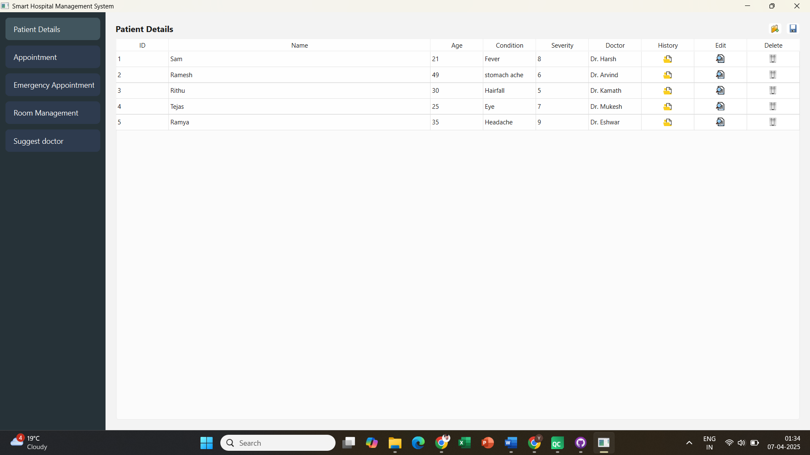
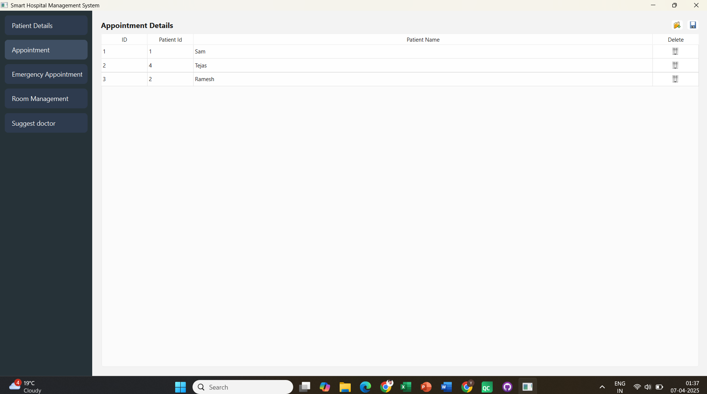
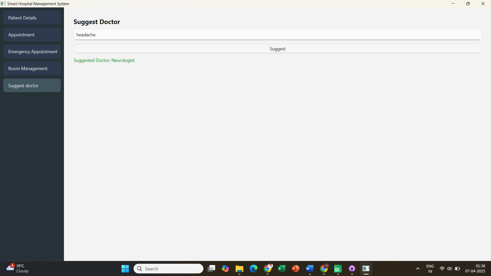

# Smart Hospital Management System

A Smart Hospital Management System is an advanced, integrated platform designed to streamline and optimize healthcare operations by incorporating intelligent modules for comprehensive patient care. It efficiently handles patient management by maintaining digital records, tracking admissions and discharges, and automating routine administrative tasks. The system keeps a detailed medical history for each patient, ensuring quick access to past diagnoses, treatments, and prescriptions, which aids in better clinical decisions. Room management is seamlessly handled by monitoring bed availability, occupancy status, and sanitation schedules. The appointment module supports both scheduled and emergency bookings, reducing wait times and improving responsiveness during critical situations. Additionally, a symptom-based query lookup feature empowers patients and healthcare providers to quickly identify potential conditions and recommend appropriate departments or specialists, significantly enhancing the diagnostic and treatment workflow.

# About this project

This project is done in C++ and includes usage of various data structures and also is written with the help of QT for the frontend. Used sqlite to store the persistent data.
* Patient Management System - List
* Appointment Managment System - FIFO
* Emergency Appointment Managment System - LIFO
* Room Managment System - Array
* Medical History Managment System - AVL tree

# Images

# Author

Yashas Besanahalli Vasudeva